**Penetration Tester** · exploring **Reverse Engineering**

 

---

## ⚙️ Tech Stack

---

## 🎯 Where I Train

---

## 🎓 Certifications

-161b22?style=for-the-badge&logo=hackaday&logoColor=00ff41)

---

## 🖥️ Currently On

---

## 📈 GitHub

<picture>
  <source media="(prefers-color-scheme: dark)" srcset="https://raw.githubusercontent.com/platane/snk/output/github-contribution-grid-snake-dark.svg" />
  
</picture>

